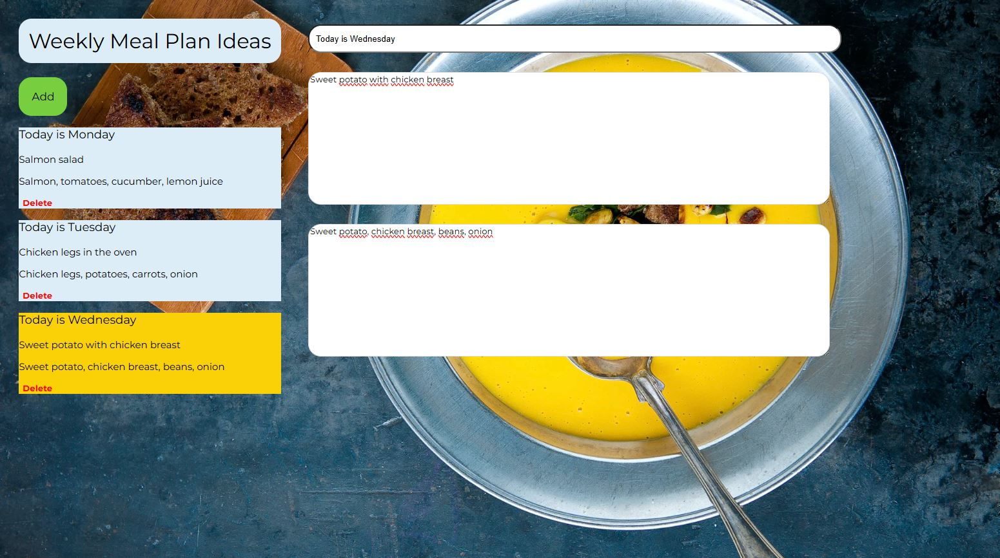

# Weekly Meal Planner

## Demo  
🔗 View the app on Netlify  
(https://weekly-meal-planner.netlify.app/)

## Project Description

**Weekly Meal Planner** is a React application that allows users to plan meals several days in advance.

The app is built using **React (Vite)** and consists of two main components:

- **MyList.jsx** — displays the weekly meal plan as cards.
- **MyMealsAndIngredients.jsx** — provides input fields for entering:
  - the day of the week
  - the menu for that day
  - the ingredients needed

All entered information appears in the first component as individual cards, each with a **Delete** button for removal.

Cards can be added using the **Add** button and are rendered using the `.map()` method.

When a card is clicked:
- the card becomes active
- the input panel becomes active for editing
- the state `selectedDay` is set to the card’s id

Using the `getActiveMeal()` function and the `.find()` method, the app retrieves the selected object from the `mealPlans` state array, which stores all card data.

When editing a card, the `updateDay()` function is triggered.  
It receives the updated data as an object, replaces the edited item, and updates the state with the new values.

To preserve data between browser sessions, the application uses **localStorage**.

No installation is required.

## Here's what the app looks like:

## How to Use:
- Click the **Add** button to create a new card.
- Click the newly created card to open the editing fields.
- Enter the day, meal plan, and ingredients.
- Click **Add** again to create additional cards.
- Click **Delete** to remove a card.
- Clicking a card activates it for editing.
- Your data is saved automatically and remains after refreshing the browser.

## Features:
- Plan meals for multiple days.
- Add, edit, and delete meal cards.
- Active card selection and editing.
- Dynamic rendering using `.map()`.
- State-based editing using `.find()` and custom update logic.
- Persistent data storage using localStorage.
- Clean and intuitive user interface.

## Requirements:
- A modern web browser
- JavaScript enabled
